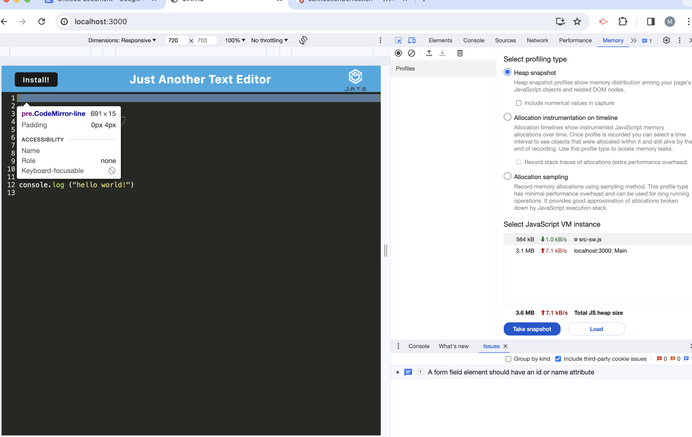

# correctionConnection
PWA: Text editor
By Maymi Sarr

## Table of contents
- [Description](#description)
- [Installation](#installation)
- [Screenshot](#screenshot)
- [Link](#link)

## Description
This text editor app is for developers to create and retrieve notes and code snippets at any time with or without internet access, so that no code is lost. The “correctionConnection” text editor is a single page PWA app (that can run offline) useful for storing and retrieving data.

## Installation

Package.json

Render

Package-lock.json

## Screenshot

## Link
http://localhost:3000/
